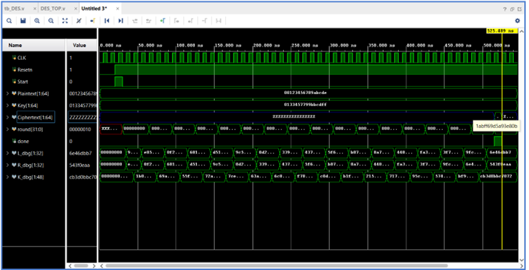
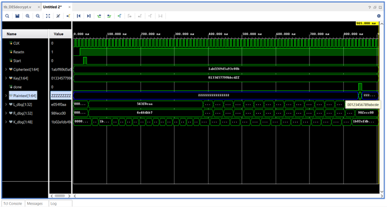

# DES64 Encryption/Decryption Hardware Implementation

A Verilog HDL implementation of the DES (Data Encryption Standard) encryption and decryption algorithm.

---

## Overview

This project implements the DES block cipher architecture using hardware design techniques in Verilog HDL.

Main components include:

- Initial Permutation (IP)
- Final Permutation (FP)
- 16-round Feistel Network
- Key Schedule Generation
- Encryption and Decryption
- FSM-based Control Unit
- Datapath architecture

The design was verified using simulation testbenches and synthesized for FPGA implementation.

---

## Features

- 64-bit DES encryption/decryption
- Verilog RTL implementation
- FSM-controlled architecture
- 16-round Feistel structure
- Functional simulation and verification
- FPGA synthesis ready

---
## Schematic Datapath
**Schematic Datapath Encrypt:**


**Schematic Datapath Decrypt:**

---
## Technologies Used

- Verilog HDL
- Vivado
- FPGA Design
- Finite State Machine (FSM)
- Digital Logic Design

---

## Project Structure

```text
rtl/    -> Verilog source files
tb/     -> Testbench files
docs/   -> FSM and waveform images
```

---

## Simulation Result

Example standard DES test vector:

| Plaintext | Key | Ciphertext |
|---|---|---|
| 00123456789ABCDE | 0133457799BBCDFF | 1ABFF69D5A93E80B |
| 0123456789ABCDEF | 133457799BBCDFF1 | 85E813540F0AB405 |
| 1111111111111111 | 2222222222222222 | 08024FCF811DA672 |
| 0000000000000000 | 0000000000000000 | 8CA64DE9C1B123A7 |
| FFFFFFFFFFFFFFFF | FFFFFFFFFFFFFFFF | 7359B2163E4EDC58 |
| AAAAAAAAAAAAAAAA | 5555555555555555 | 343A09F9B2CB5CCA |
| 1234567890ABCDEF | 0F1571C947D9E859 | 180419FB1A3814AF |
| FEDCBA9876543210 | AABB09182736CCDD | CA246075E30CA7B7 |
| 13579BDF2468ACE0 | 1A2B3C4D5E6F7788 | 55ACF9E2DAA89BE9 |
| CAFEBABE12345678 | 0A0B0C0D0E0F1011 | 9782675A69186083 |

---

## Performance

- FSM-based sequential architecture
- Approximately 50 clock cycles per encryption
- **Synthesized Fmax:** ~227 MHz
- Approximately 80 clock cycles per encryption
- **Synthesized Fmax:** ~247 MHz

## Waveform result
**Waveform Encrypt:**


**Waveform Decrypt:**



